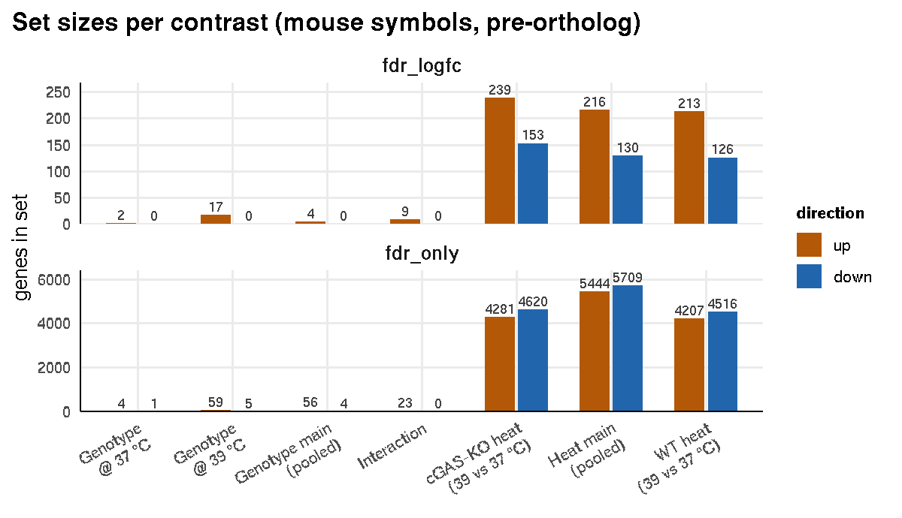
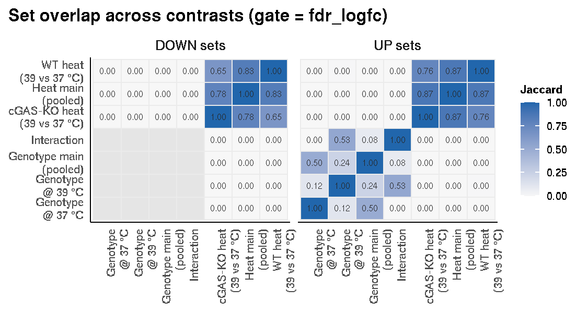
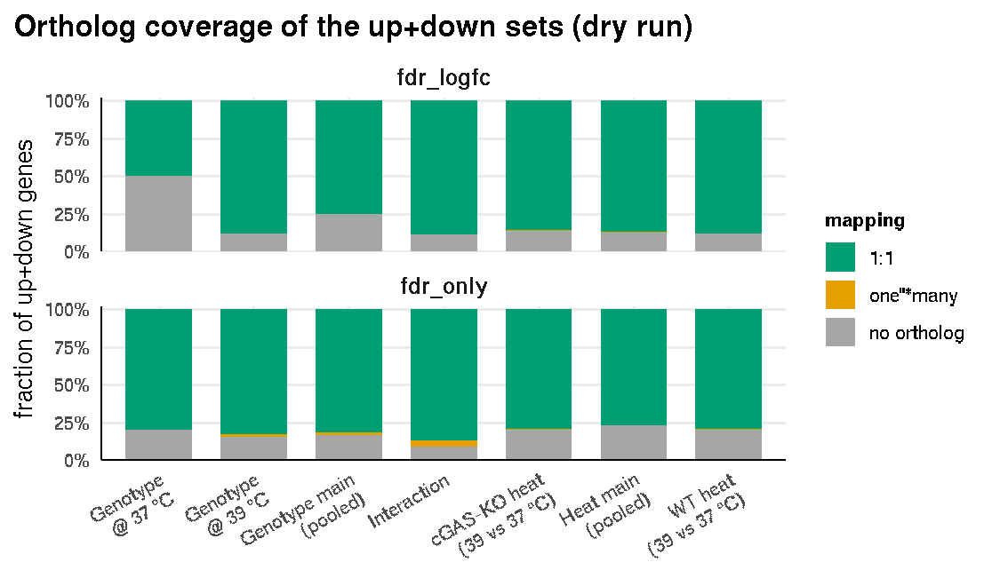

Signature review
================

*Notebook run 2026-07-03 22:25 UTC.*

## Where we are

The mouse pipeline is done — `00`–`16` gave us DE, GSEA, TF, PROGENy,
GATOM, CoReSh for all seven contrasts. It’s 19,679 *mouse* symbols
spread across seven contrasts, and the human compartments need **one
frozen, ortholog-mapped signature** they can all score against.

Stage 17 reshapes `master_de_genes.csv` into projectable pieces —
up/down gene sets and signed-`t` ranked lists. Here I double check and
*look* at what I’m about to freeze and make three calls: - which
contrasts to ship, - which significance gate, and - how to handle
ortholog ambiguity.

Stage 17 knobs used: \* FDR \< **0.05**, \* |log2FC| ≥ **1**, \*
everything ranks on the signed **t**-statistic.

It carries **both** gates forward \* `fdr_only` and \* `fdr_logfc`

to visually compare the effect of gate and contrast. I’m planning to
freeze **WT\_heat, KO\_heat, Interaction** at gate **fdr\_logfc** (read
from `decisions.projection`).

## 1\. How big are these sets, and which gate?

How many genes actually survive each threshold. The two gates give very
different answers.



| contrast     | role       | fdr\_logfc\_down | fdr\_logfc\_up | fdr\_only\_down | fdr\_only\_up |
| :----------- | :--------- | ---------------: | -------------: | --------------: | ------------: |
| WT\_heat     | primary    |              126 |            213 |            4516 |          4207 |
| KO\_heat     | comparator |              153 |            239 |            4620 |          4281 |
| Interaction  | comparator |                0 |              9 |               0 |            23 |
| Geno\_at\_39 | comparator |                0 |             17 |               5 |            59 |
| Geno\_at\_37 | comparator |                0 |              2 |               1 |             4 |
| Temp\_main   | comparator |              130 |            216 |            5709 |          5444 |
| Geno\_main   | comparator |                0 |              4 |               4 |            56 |

Set sizes by contrast × gate × direction (mouse symbols, before ortholog
mapping).

**What we see** \* `WT_heat` alone is \~4k up and \~4.5k down. At 39 °C
basically a third of the transcriptome moves, which tracks (heat shock
is a massive, genome-wide program) but it makes for a mushy signature:
score anything against a 4,000-gene set and you’ll get a hit off general
transcriptional activity, not the specific axis. \* Adding the |log2FC|
≥ 1 gate cuts `WT_heat` down to **213 up / 126 down** still plenty of
genes, but now they’re the ones that actually moved a lot.

The small contrasts nearly vanish under the strict gate. `Interaction`
drops to 9 up / 0 down, `Geno_at_39` to 17/ 0.

Downstream we’ll move on with `fdr_logfc`, rather ship lean `WT_heat`.
The gate only touches the binary up/down sets for the AUCell/UCell
inputs. The ranked `.rnk` files stay the full signed-`t` list, so
fgsea/decoupleR on the human pseudobulk isn’t affected by this call.

## 2\. Are the contrasts saying different things?

If `Temp_main` is basically a copy of `WT_heat`, there’s no point
shipping both. Jaccard overlap tells me how much the sets actually
share.



**What we see.** - The diagonal is 1 (each set with itself), and -
off-diagonal shows divergence.

Refresher: 2x2 factorial: genotype {WT, cGASKO} x temperature {37, 39},
n=5/group **Groups** - “WT\_37” - “cGASKO\_37” - “WT\_39” - “cGASKO\_39”

**Contrasts** - “WT\_heat” = “WT\_39” - “WT\_37”; \# heat effect in WT -
“KO\_heat” = “cGASKO\_39” - “cGASKO\_37”; \# heat effect in cGAS-KO
samples - “Temp\_main” = “0.5*(WT\_39 + cGASKO\_39) - 0.5*(WT\_37 +
cGASKO\_37)”; \# aggregated/pooled temperature effect across genotypes -
“Interaction” = “(WT\_39 - cGASKO\_39) - (WT\_37 - cGASKO\_37)”; \#
cGAS-dependent heat effect (see
`02_analysis/config/analysis_config.yaml`)

At `fdr_logfc` gate, WT\_heat and KO\_heat are largely overlapping sets,
but “Interaction” is mostly non-overlapping, which is interesting,
though the set is 9 genes.

| set         | n\_genes | shared\_WT\_KO | unique\_vs\_others |
| :---------- | -------: | -------------: | -----------------: |
| WT\_heat    |      339 |            305 |                 34 |
| KO\_heat    |      392 |            305 |                 81 |
| Interaction |        9 |            305 |                  3 |

Set sizes / sharing at gate=fdr\_logfc (up+down union, mouse symbols).

    ## Shared WT_heat ∩ KO_heat — the common heat core (genotype-independent):

    ## 1110002J07Rik, 1810073O08Rik, 2010003K11Rik, 4930459C07Rik, A530013C23Rik, AA467197, Abcb4, Abcc8, Accs, Actbl2, Adam8, Adamts18, Adamtsl2, Adcy4, Adm, Adora2a, Adora2b, Agap1, Ahr, Ak4, Ak5, Aldh1a2, Ankrd33b, Ano1, Anxa2, Aplp1, Areg, Arhgef25, Arl5c, Arsb   … (+275 more)

    ## 
    ## WT_heat-unique (heat in the cGAS-competent genotype only):

    ## 5430427O19Rik, Abi3, Acss1, Anxa3, Arhgap24, Atf3, Bmp1, Cpne6, Cst6, Dab2, Emilin2, Entpd1, Ephb2, Fam167a, Gm43430, Hpgds, Hspg2, Lpar6, Lzts1, Mab21l3, Myl10, Neo1, Oas3, Pigz, Pik3ap1, Plk3, Ptgs2, Six5, Slc2a9, Slc35d3   … (+4 more)

    ## 
    ## KO_heat-unique (heat only in cGAS-KO):

    ## 1700016P03Rik, 4933423P22Rik, 9930111J21Rik2, Abcb11, Abi3bp, Adamts17, AL935121.1, Aldh1l2, Ankrd37, Arid3a, Bend5, Bspry, Card10, Cavin1, Ccdc184, Cd72, Cdcp1, Col27a1, Csgalnact1, Cul9, Ddx58, Ddx60, Dynlt1c, Efna2, Fam43a, Fat2, Fbn1, Fgfr1, Glp1r, Gm12867   … (+57 more)

    ## 
    ## Interaction — full set (the cGAS-dependent heat response):

    ## Ifi206, Ifi208, Ifit1, Irf7, Mx1, Oasl2, Rtp4, Trim30d, Xaf1

I believe all might be of value for the temperature question. and might
highlight interesting loci on the embeddings later on.

## 3\. Does it survive the trip to human?

Need to count how many genes will survive orthology mapping



| contrast    | role       | mouse\_up | mouse\_down | human\_up | human\_down | human\_up\_down | verdict |
| :---------- | :--------- | --------: | ----------: | --------: | ----------: | --------------: | :------ |
| WT\_heat    | primary    |       213 |         126 |       199 |          94 |             293 | keep    |
| KO\_heat    | comparator |       239 |         153 |       218 |         113 |             331 | keep    |
| Interaction | comparator |         9 |           0 |         7 |           0 |               7 | keep    |

Same sets, mapped mouse→human (dry run, gate=fdr\_logfc). ‘TRIVIAL’ =
fewer than 5 human genes in up+down.

    ## No trivial-drop clash: every exported contrast clears the floor (or the drop rule is off).

Major contrasts defined sets should be fine. The Interaction needs
visual inspection on whether its would be scattered noise or not. AUCell
on a small set is unstable, might compare to UCell, though still ….
Might try out simple expression or mean/z-scored expression, or per-gene
z-scoring and show individual genes, see if they are interesting. Might
just as well plot standard FeaturePlots or VlnPlots. Seurat’s
AddModulesScore or scanpy’s score\_genes might work, but depends on seed
and background. Also not sure if they all are going to move up or down
in whatever we are looking for. Would need to test. Might get a better
angle on cGAS dependence from SAVI dataset.

## 4\. Does `WT_heat` look like heat-stressed Tregs?

What are the genes sorted by signed `t`: noise or biology?

| rank | up\_gene   | up\_t | down\_gene | down\_t |
| ---: | :--------- | ----: | :--------- | ------: |
|    1 | Gja5       | 29.28 | Rbm3       | \-26.12 |
|    2 | Galm       | 25.52 | Rbm3-ps    | \-24.58 |
|    3 | Il1rn      | 25.38 | Sgk3       | \-22.62 |
|    4 | Timp1      | 24.92 | Cirbp      | \-21.92 |
|    5 | Sdc1       | 22.89 | Gm48583    | \-21.27 |
|    6 | Hsph1      | 22.77 | Gm10156    | \-20.89 |
|    7 | Serpinb6a  | 21.02 | Cd40       | \-19.89 |
|    8 | Fam83g     | 20.74 | Rhob       | \-19.74 |
|    9 | Slco4a1    | 20.52 | Pde1b      | \-19.60 |
|   10 | Gap43      | 20.36 | Abca1      | \-18.99 |
|   11 | Gramd1b    | 19.87 | Ahr        | \-18.63 |
|   12 | Plek2      | 19.49 | Zfp944     | \-18.35 |
|   13 | C3         | 19.17 | Acsl6      | \-18.29 |
|   14 | Plek       | 19.16 | Slc44a1    | \-18.29 |
|   15 | Crabp2     | 18.77 | Usp22      | \-18.26 |
|   16 | Dot1l      | 18.71 | Arl5c      | \-18.11 |
|   17 | St6galnac6 | 18.56 | Rcbtb2     | \-18.03 |
|   18 | Rorc       | 18.54 | Ncmap      | \-17.85 |
|   19 | Itga5      | 18.46 | Plekhd1    | \-17.46 |
|   20 | Csgalnact1 | 18.32 | Galnt10    | \-17.45 |
|   21 | Ophn1      | 17.95 | Pyroxd2    | \-17.38 |
|   22 | Idi2       | 17.73 | Crebrf     | \-17.28 |
|   23 | Tspan3     | 17.46 | Gm12940    | \-17.07 |
|   24 | Glb1       | 17.39 | Traf5      | \-16.72 |
|   25 | Fah        | 17.04 | Scarb2     | \-16.66 |
|   26 | Lgals3     | 16.80 | Tbc1d16    | \-16.51 |
|   27 | Itga3      | 16.78 | Adamtsl2   | \-16.44 |
|   28 | Ttc39c     | 16.69 | Sell       | \-16.39 |
|   29 | Rpl10a-ps2 | 16.63 | Igfbp4     | \-16.29 |
|   30 | Hspa4l     | 16.58 | Rbmx       | \-16.25 |

WT\_heat top-30 up (highest signed t) and top-30 down (lowest).

Seems like a general stress-protective response with some migratory
hints: \* protein unfolding protection: Hsph1 and Hspa4l \* complement
activation via C3 \* inflammatory counterbalance of Il1rn \* Itga5 and
Itga3 breaking anchors which go up so cells detach from resting spot and
grab onto something new (Sdc1) \* Gap43 and Plek2 changing cell shape
via cytoskeleton modifications \* Timp1 inhibits matrix
metalloproteinases, in an attempt to protect structural matrix of tissue
from being degraded. \* Serpinb6a protease inhibitor, that safeguards
the insides of the cell from self-digestion through proteolytic enzymes
\* Dot1l epigenetic reponse, changing methylation behaviour \*
interesting retinoic pattern with Crabp2 (trasport vit A/retinoic acid
to the nucleus) + Rorc (nuclear receptor transcription factor, master TF
of Th17’s) - might be a differentiation switch into more
pro-inflammatory, more Th17-like state. Though we know that Th17 are
more protected from heat than other Th’s. There’s a wet lab expectation
that Tregs are potentially more hypoxia-sensitive under 39 degrees, and
might be more prone to death under 39. Don’t know for now just got to
keep an eye on it

## 5\. Where are we?

Pulling it together.

1.  **Which contrasts** Will explore both
      - `WT_heat` (primary) along with
      - `KO_heat`
      - and `Interaction`
2.  **Gate** → `fdr_logfc`.
3.  **Ortholog ambiguity** keeping the defaults (one→many = union / `t`
    to each; many→one = max|`t`|; no ortholog = drop and log;). Every
    dropped gene stays auditable in `ortholog_map.tsv`.

**Downstream:** Later Phases 1–4 load these from
`03_results/human_projection/` \* the `.rnk` files feed fgsea/decoupleR
on donor-level human *pseudobulk* (the primary evidence), and \* the
up/down `.txt` sets feed AUCell/UCell where only per-cell scoring is
possible. \* Keeping `WT_heat` as the headline, but will EDA other sets
as well

> **Green light:** set `decisions.projection.status: APPROVED` in
> `analysis_config.yaml` then run `18_projection_export.R` +
> `18_projection_export_viz.R`. Until then 18 refuses to run and nothing
> is frozen.

``` r
# Current proposed defaults (what 18 will use once status flips to APPROVED):
str(yaml::read_yaml(here("02_analysis/config/analysis_config.yaml"))$decisions$projection)
```

    ## List of 5
    ##  $ status            : chr "APPROVED"
    ##  $ role_primary      : chr "WT_heat"
    ##  $ contrasts_primary : chr [1:3] "WT_heat" "KO_heat" "Interaction"
    ##  $ gate              : chr "fdr_logfc"
    ##  $ ortholog_ambiguity:List of 6
    ##   ..$ one_mouse_to_many_human    : chr "union"
    ##   ..$ many_mouse_to_one_human    : chr "max_abs_t"
    ##   ..$ no_human_ortholog          : chr "drop"
    ##   ..$ min_support                : int 3
    ##   ..$ drop_interaction_if_trivial: logi TRUE
    ##   ..$ trivial_min_genes          : int 5
